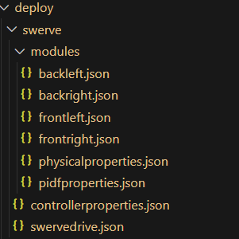
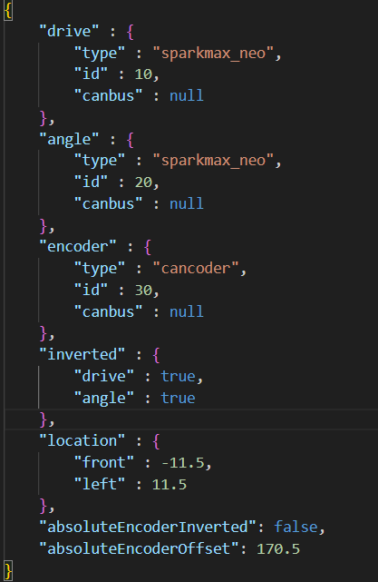
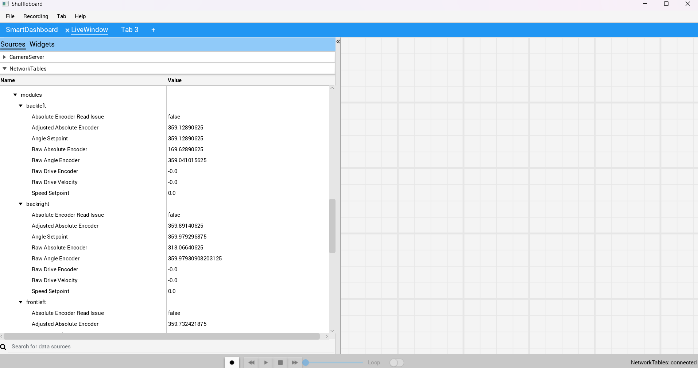
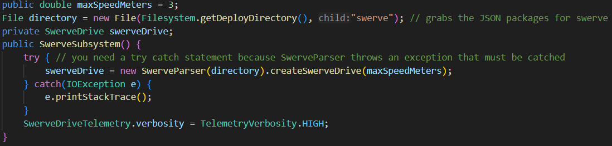
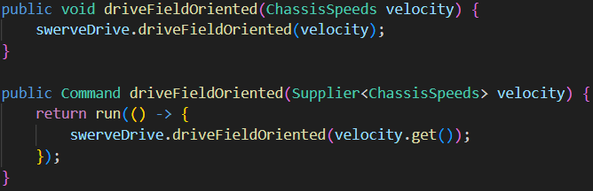
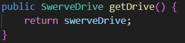
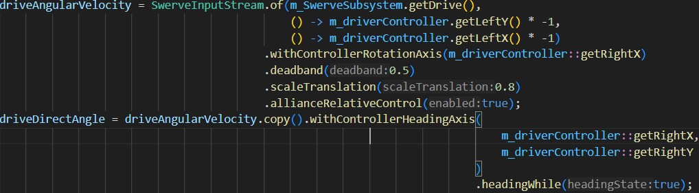
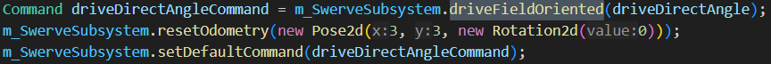

# 2026-gear-bears

## Documentation
### deploy/swerve

<br>
The files from ```backleft.json``` to ```frontright.json``` are for the 4 swerve modules, or wheels. Having the settings within the 4 swerve modules correct is essential, otherwise the swerve wheels will move unexpectedly.<br>
 <br>
Above is an example of a swerve drive module. As you can tell from the "location" setting, this module is for the back left swerve module. Look at the [the YAGSL website for a more in-depth explanation of each configuration](https://docs.yagsl.com/configuring-yagsl/configuration):link: <br>

### A couple of terms that are not fully explained.
 - **Ramp Rate:** The amount of time it takes to change speeds on a swerve module motor.
 - **currentlimit:** This is explained in YAGSL but it is hard to find what it means. It is the limit of how much eletrical current you pull for both the angle and drive motors. They provide a recommended current of 40A drive 20A angle, but it depends on the type of swerve module.
- **absoluteEncoderOffset:** Each swerve module has a different offset that can allow you to make each module face the same direction. The way to find the absolute encoder offset for each module is to set each wheel straight and run your robot. <br>

<br>
Above is an example of shuffleboard, where you can see what values you need for absolute encoder offset. For the value, refer to the raw absolute encoder reading.
- **IMU:** The gyroscope, used to help the robot know where it is relative where it started from. when it says to inverted on ```swervedrive.json``` it means you are inverting the reading from the gyroscope

**This will help you when making the swerve drive work**
<br>
- When working on swerve drive or setting swerve drive up. It is likely that the swerve drive will work weirdly or unexpectedly. One possible fix would be [YAGSL's eight steps](https://docs.yagsl.com/fundamentals/swerve-drive):link:

### Swerve code
#### SwerveSubsystem
Like all Java classes, we start with the constructor. For this project, all we do is set up swerve drive from our swerve drive configuration. To use the swerve configuration made previously, you need to do some file reading using ```FRC```'s ```File``` object. Below is an example of setting up a SwerveSubsystem. <br>
 <br>
As you can tell, there is a ```try catch``` statement. If you are unaware, a ```try catch``` statement is used to attempt a block of code and if it finds the error type in the catch statement it will end the execution of that code and move to the catch statement. View a ```try catch``` as an ```if else``` statement that runs true if there are no errors and false if statement encounters an error.

```SwerveDriveTelemetry.verbosity = TelemetryVerbosity.HIGH;``` is a line of code that gives records more data for the swerve drive modules and system as a whole. Setting ```verbosity``` to ```HIGH``` will allow you to debug swerve drive much easier.



Above is an example of drive field oriented. One method applies a ```velocity``` to the robot to move it towards the desired point. The other method returns a ```command``` to be run and takes in a ```Supplier``` of ```ChassisSpeeds```. If you are unaware a Supplier object is a value stored inside a lambda function.



Above is an example of a ```getter``` method for the drive ```object```, used for swerve input stream. A ```getter``` method allows you to get an ```object``` or value that is ```private``` within the class for privacy but is needed in other portions of the code. ```Getter``` methods allow you to keep the ```variable``` from being tampered with outside of the ```object``` but allows the use of the value outside of the function.



Above is an example of setting up the input values for swerve drive using a controller
### Broken Down Into Components

**SwerveInputStream.of()** - Makes a new swerve input stream object with a swerve drive instance, and input x and y values, using lambda functions.<br>
**.withControllerRotationAxis()** - Sets the function to be called when grabbing what rotation the robot should be at.<br>
**.deadband()** - Sets the minimum controller axis value. Since we set the ```deadband``` to 0.5, you'd need a minimum controller value of 0.5. This reduces the amount of ```drift``` you might get from no ```deadband``` at all.<br>
**.scaleTranslation()** - Sets the ```scale``` value for the speed ```vectors```. So if the ```scale``` was set to ```0.5``` it would be cut in half, if the ```scale``` was set to ```1``` it would stay the same, and if you were to set the ```scale``` to ```2``` the speed would be doubled.<br>
**allianceRelativeControl()** - Sets whether or not the robot should ```flip``` its control relative to what **alliance** the robot is on that round. This is very useful for the ```drive team``` so they can drive the robot easier without confusion.<br>
**instance.copy()** - Copies the instance of ```SwerveInputStream```. Great when you have multiple similar ```SwerveInputStream```'s. <br>
**.withControllerAxisHeading()** - Gives the robot the values to look at when finding what axis to turn to. <br>
**.headingWhile** - Refers to the Heading State, which is referring to the orientation of the wheels relative to the field. When enabled, the robot will constantly track the desired heading and adjust accordingly through Heading Correction.<br>

**how to apply the input stream to the swerve drive** -
<br>
First you want to make you input stream into a command as seen above. **Note**: we used ```driveFieldOriented``` which as you might remember their are two functions for ```driveFieldOriented``` one that takes a ```ChassisSpeeds Supplier```this is the function we are using because it returns a ```Command```. ```SwerveInputStream```'s can act like a ```ChassisSpeeds Supplier``` because ```SwerveInputStream``` impliments ```Supplier<ChassisSpeeds>```. Then you want to set the ```default command``` for your swervedrive subsystem to be the command you used previously. A **default command** is a certain command that is run every 20 milliseconds [look at FRC WPIlib for more information about command based programming](https://frcdocs.wpi.edu/en/2020/docs/software/commandbased/what-is-command-based.html) :link: